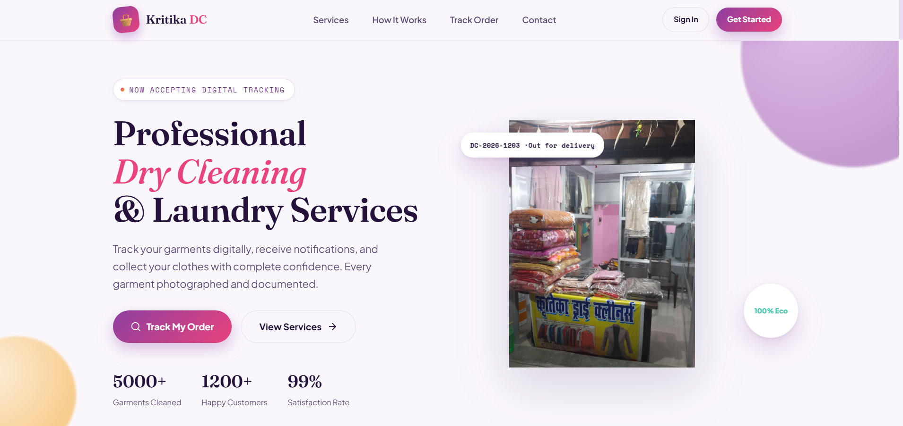

# Laundry Management System

A modern **Laundry Management System** designed to simplify laundry shop operations by providing a digital platform for managing customers, laundry orders, clothing items, payments, and order status.

**Project Status:** Active Development
**Live Website:** [laundary-shop.vercel.app](https://laundary-shop.vercel.app/)



---

## Features

### Customer Management

* Add and manage customer information
* Store customer contact details
* View customer records
* Track customer order history

### Laundry Order Management

* Create new laundry orders
* Add multiple clothing items to an order
* Record item quantities
* Track order dates
* Track expected delivery dates
* Manage order status

### Order Status Tracking

```text
Order Received → Washing → Processing → Ready → Delivered
```

### Clothing & Item Management

* Add different types of clothing
* Record quantities
* Associate items with specific orders
* Calculate order totals

### Payment Management

* Record order amounts
* Track payment status
* Manage pending and completed payments
* Associate payments with specific orders

---

## System Architecture

```text
┌──────────┐      ┌────────────────┐      ┌────────────────────┐      ┌────────────┐
│   User   │ ───▶ │    Frontend    │ ───▶ │      Backend       │ ───▶ │  MongoDB   │
│          │      │  HTML/CSS/JS   │      │  Node.js/Express   │      │  Database  │
└──────────┘      └────────────────┘      └────────────────────┘      └────────────┘
```

---

## Database Design

```text
┌────────────┐       ┌────────────┐       ┌──────────────┐       ┌────────────────┐
│  Customer  │ 1 ─ N │   Order    │ 1 ─ N │ Order Items  │ N ─ 1 │ Clothing Item  │
└────────────┘       └────────────┘       └──────────────┘       └────────────────┘
```

### Customer

| Field        | Description                |
| ------------ | -------------------------- |
| `customerId` | Unique customer identifier |
| `name`       | Customer name              |
| `phone`      | Customer contact number    |
| `address`    | Customer address           |
| `createdAt`  | Registration date          |

### Order

| Field           | Description             |
| --------------- | ----------------------- |
| `orderId`       | Unique order identifier |
| `customerId`    | Associated customer     |
| `orderDate`     | Order creation date     |
| `deliveryDate`  | Expected delivery date  |
| `status`        | Current order status    |
| `totalAmount`   | Total order amount      |
| `paymentStatus` | Payment status          |

### Order Item

| Field      | Description            |
| ---------- | ---------------------- |
| `itemId`   | Unique item identifier |
| `orderId`  | Associated order       |
| `itemType` | Type of clothing       |
| `quantity` | Number of items        |
| `price`    | Price per item         |

---

## Order Workflow

```text
┌──────────────┐    ┌──────────────┐    ┌────────────────┐
│   Customer   │───▶│ Create Order │───▶│   Add Items    │
└──────────────┘    └──────────────┘    └───────┬────────┘
                                                 │
                                                 ▼
┌──────────────┐    ┌──────────────┐    ┌────────────────┐
│  Delivered   │◀───│   Payment    │◀───│   Processing   │
└──────────────┘    └──────────────┘    └────────────────┘
```

---

## Tech Stack

### Frontend

* HTML5
* CSS3
* JavaScript

### Backend

* Node.js
* Express.js

### Database

* MongoDB

### Deployment

* Vercel

### Development Tools

* Git
* GitHub
* Visual Studio Code
* Postman

---

## Project Structure

```text
Laundry-Management/
│
├── frontend/
│   ├── assets/
│   ├── css/
│   ├── js/
│   └── pages/
│
├── backend/
│   ├── controllers/
│   ├── models/
│   ├── routes/
│   ├── middleware/
│   ├── config/
│   └── server.js
│
├── landing.png
├── .env
├── .gitignore
├── package.json
└── README.md
```

---

## API Structure

### Customers

```http
GET    /api/customers
GET    /api/customers/:id
POST   /api/customers
PUT    /api/customers/:id
DELETE /api/customers/:id
```

### Orders

```http
GET    /api/orders
GET    /api/orders/:id
POST   /api/orders
PUT    /api/orders/:id
DELETE /api/orders/:id
```

### Order Status

```http
PATCH  /api/orders/:id/status
```

### Payments

```http
GET    /api/payments
POST   /api/payments
PATCH  /api/payments/:id
```

---

## Installation

### 1. Clone the Repository

```bash
git clone https://github.com/your-username/laundry-management.git
```

### 2. Navigate to the Project

```bash
cd laundry-management
```

### 3. Install Dependencies

```bash
npm install
```

### 4. Configure Environment Variables

Create a `.env` file:

```env
PORT=5000
MONGODB_URI=your_mongodb_connection_string
```

### 5. Start the Development Server

```bash
npm run dev
```

---

## Environment Variables

| Variable      | Description               |
| ------------- | ------------------------- |
| `PORT`        | Port used by the backend  |
| `MONGODB_URI` | MongoDB connection string |

Never commit your `.env` file to GitHub.

Add the following to `.gitignore`:

```gitignore
.env
node_modules/
```

---

## Example Order

```text
Order ID: ORD-1001

Customer:
Aditya Jaiswal

Items:
- Shirt       × 3
- Trousers    × 2
- Bedsheet    × 1

Total Items: 6

Status:
Washing

Payment:
Pending
```

---

## Security

The application follows standard security practices:

* Store credentials in environment variables.
* Never expose database credentials in source code.
* Validate API requests.
* Sanitize user input.
* Restrict unauthorized access to customer and payment information.
* Use HTTPS in production.
* Keep dependencies updated.

---

## Learning Outcomes

This project demonstrates practical experience with:

* Full-stack web development
* CRUD operations
* REST API development
* Database design
* MongoDB data modeling
* Frontend-backend integration
* Environment configuration
* Git and GitHub
* Web application deployment
* Real-world business workflow automation

---

## Contributing

Contributions are welcome.

1. Fork the repository.
2. Create a feature branch:

```bash
git checkout -b feature/new-feature
```

3. Make your changes.
4. Commit the changes:

```bash
git add .
git commit -m "Add new feature"
```

5. Push the branch:

```bash
git push origin feature/new-feature
```

6. Open a Pull Request.

---

## License

This project is available for educational and personal use.

---

## Developed By

### Aditya Jaiswal

**BCA Student | Full-Stack Developer**

Developed by **Aditya Jaiswal** as a practical full-stack web development project.

---

## Live Website

[**laundary-shop.vercel.app**](https://laundary-shop.vercel.app/)
